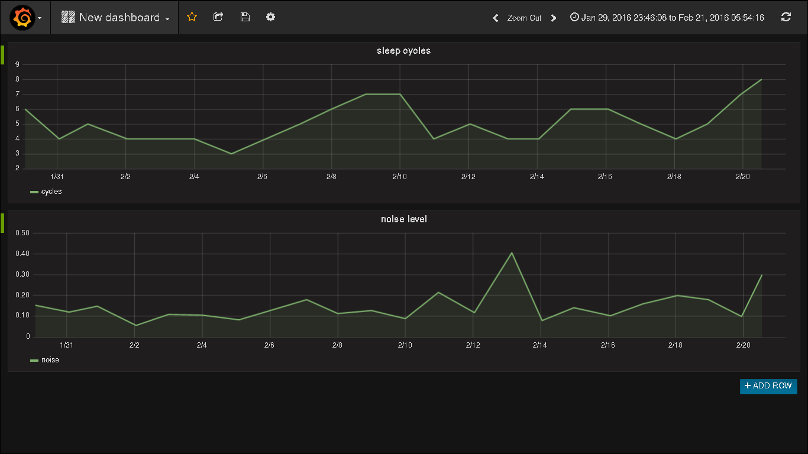

# py-sleep-influxdb

Parse Sleep As Android csv and store data in InfluxDb

## Usage

download the csv backup from Sleep As Android and store the file as sleep.csv. Configure 

- influxdb_dbname
- influxdb_user
- influxdb_password
- influxdb_host
- influxdb_port

Create the database in InfluxDb and start the script.

The script takes the `From` field from the csv for the `time` field in InfluxDb. The script will write one record in InfluxDb per record in csv. `actigraphic` and `noise` records are currently not stored.

For the documentation of the csv format take a look at http://sleep.urbandroid.org/documentation/developer-api/csv/

The data can than be plotted with Grafana.

